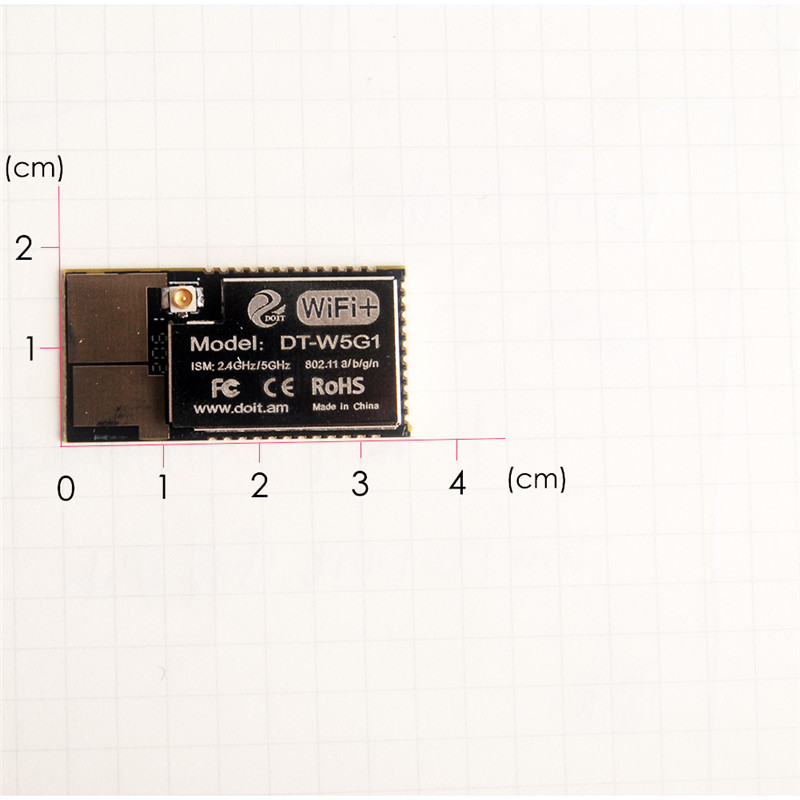
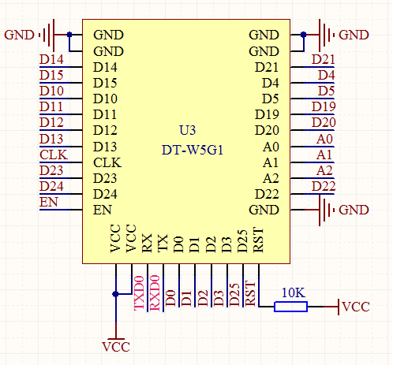

# DT-W5G1-5G-WIFI-MODULE - WF6000

## Introduction

The core processor of DT-W5G1 module adopts ultra-low power processor and 2G-5G dual-frequency chip. The chip integrates 32-bit microcontroller with 16-bit streamlined mode and 160 MHz main frequency in smaller size package. DT-W5G1 has a complete Wi-Fi network function, which can be used as a slave plane and carried on other host MCUs. DT-W5G1 can be booted directly from external Flash when it responds alone. The built-in cache memory can improve the system performance and optimize the storage system. In addition, DT-W5G1 can be used as Wi-Fi adapter only through SPI/SDIO or I2C/UART, and should be applied to any microcontroller-based design.

- DT-W5G1 module supports standard IEEE802.11a/b/g/n protocol and complete TCP/IP protocol stack. Users can use this module to add networking functions to existing devices, or to build independent network controllers.
- DT-W5G1 module for maximum practicability, Wi-Fi function embedded in other systems to provide unlimited possibilities.
- DT-W5G1 module has the characteristics of wide bandwidth and long distance communication, and can be used for wireless image transmission.

## Schematic

## Features

- SOC specifications
- Built-in 160MHz MIPS RISC processor
- 512K SRAM
- Communication speed: 72Mbps (20MHz)
- Optimum balance &LLR quantification

## Wi-Fi specifications

- Support 802.11 a/b/g/n, 2.4 - 2.5GHz, 4.9 - 5.85GHz
- 2.4GHz Rx sensitivity: -75dBm/11n HT20 MCS7, Tx power: 21dBm
- 5GHz Rx sensitivity: -74dBm/11n HT20 MCS7, Tx power: 16.5dBm
- Support Station, SoftAP mode
- Support Wi-Fi Direct (P2P)
- Support CCMP (CBC-MAC, computing mode), TKIP (MICRC4), WAPI (SMS4), WEP (RC4) CRC hardware acceleration
- P2P discovery, P2P GO mode/GC mode and P2P power management
- Support seamless roamless
- Support AT remote update and cloud OTA update
- Support SmartConfig function for Android and iOS device SmartConfig

## Peripheral for Module

- 2 x UART
- 3 x ADC
- 1 x HSPI
- 1 x I2C
- 1 x I2S
- 2 x DMA
- 2 x PWM
- Max 23 x GPIOs
- 2M byte SPI Flash
- Working temperature: -30℃ - 85℃
- Module size: 17.5mm × 34.5mm

## Application

- Serial Transparent transmission
- Smart power plug/Smart LED light
- Sensor networks
- Wearable electronics
- Security ID label
- Wireless location recognition
- Wireless location system beacon
- WiFi prober
- Mesh networks
- Industrial wireless control

## Download

- [user manual](https://github.com/ElectronicaXAB3/DT-W5G1-5G-WIFI-MODULE---WF6000/raw/master/files/DOIT_DT-W5G1(V1_1)_doc.pdf)
- [LocalLinuxSetup.zip](https://github.com/ElectronicaXAB3/DT-W5G1-5G-WIFI-MODULE---WF6000/raw/master/files/LocalLinuxSetup.zip)
- [ManualforDTW5G1.zip](https://github.com/ElectronicaXAB3/DT-W5G1-5G-WIFI-MODULE---WF6000/raw/master/files/ManualforDTW5G1.zip)
- [WF6000_Multi_DownLoader_190902.zip](https://github.com/ElectronicaXAB3/DT-W5G1-5G-WIFI-MODULE---WF6000/raw/master/files/WF6000_Multi_DownLoader_190902.zip)

## Resources

- [SmartArduino / SZDOITWiKi](https://github.com/SmartArduino/SZDOITWiKi/wiki/ESP8266---DT-W5G1)
- [ElectronicaXAB3/zhdocs](https://github.com/ElectronicaXAB3/zhdocs/tree/master/zhESPSeries/DOIT_DT-W5G1)
